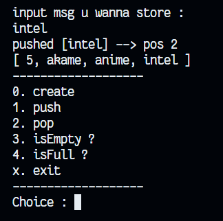

# Data structure: **Stack** by *Kotlin*

A simple, interactive command-line implementation of a Stack data structure in Kotlin. This study provides a menu-driven interface to perform standard stack operations such as `push`, `pop`, `isEmpty`, and `isFull`.

## Operations
- **Create**: Setup the storage array size.
- **Push**: Insert an item at the top.
- **Pop**: Remove the item from the top.
- **Display**: Shows the current state of the stack.




## How to Run
```powershell
java -jar .\build\libs\manual-kotlin.jar
```

## Usage
Once running, use these options:
- `0`: Create (initialize stack size)
- `1`: Push (add element)
- `2`: Pop (remove element)
- `3`: isEmpty? (check if empty)
- `4`: isFull? (check if full)
- `x`: Exit

## How to Build
```powershell
gradle build
```

## Compiling Notes
- **Compiler Version:** If compiling manually, check your version with `kotlinc -version`. You must ensure that the compiler version matches or is compatible with the one specified in the `build.gradle.kts` file.

